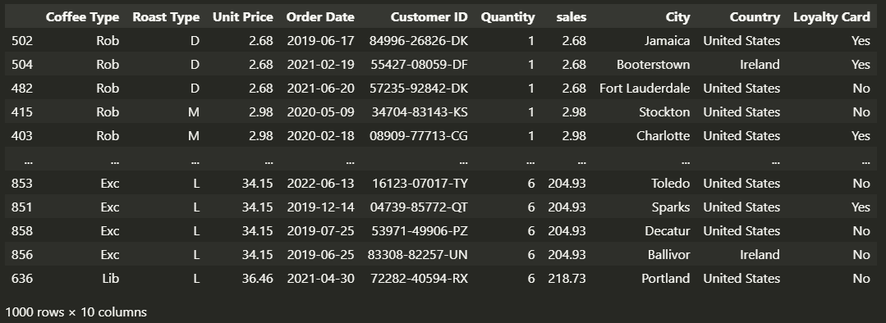
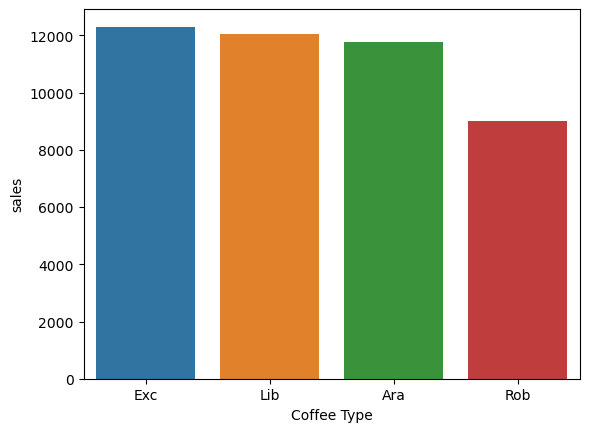
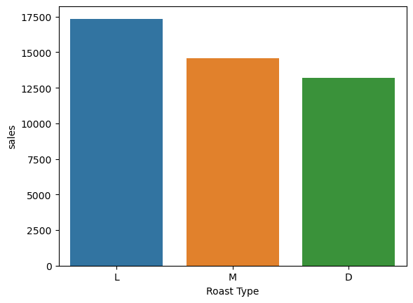
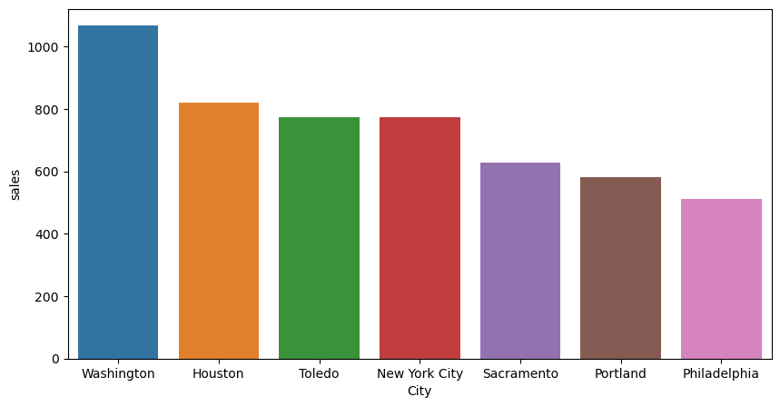
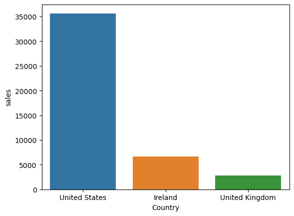
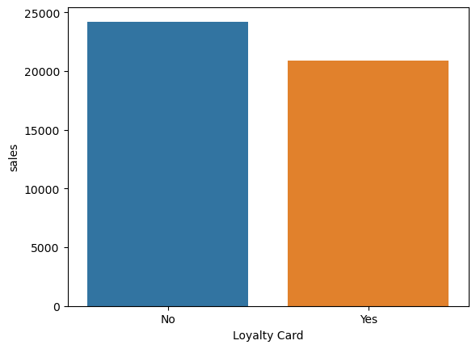
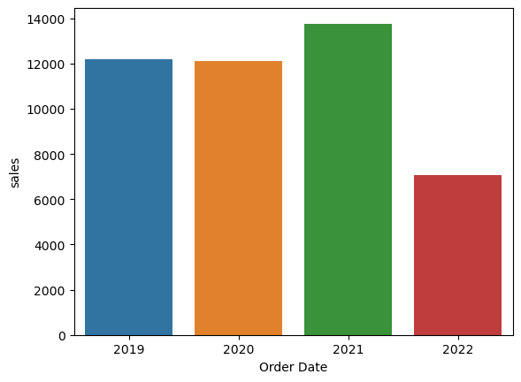
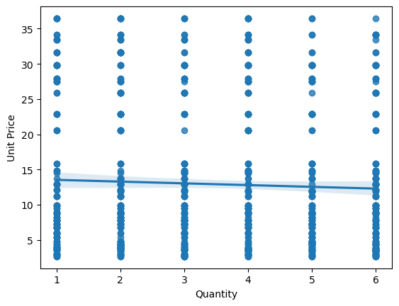

# Coffee-Bean-Sales-Analysis
In this project, I analyzed Coffee Bean Sales using Python, employing libraries such as pandas, matplotlib, and seaborn to answer my questions about this data. This included determining the most popular Coffee Type, the preferred Roast Type, visualizing the top 7 most profitable cities, assessing the most profitable country, comparing the profitability of loyalty card owners to non-owners, identifying the year with the highest sales, and exploring any relationships between unit price and quantity in customer preferences.

# Preprocessing
1) Dealing with Null data
2) Dealing with Duplicate values
3) Removing unnecessary data
4) Generate new features based on previous features

# Goals
1) Which Coffee Type is sold more?
2) Which Roast Type is sold more?
3) Plot the top 7 most profitable cities.
4) Which country is more profitable?
5) Which group is more profitable, loyalty card owners, or non-owners?
6) Which year had the highest sales?
7) Is there any relation between unit price and quantity? Are customers more inclined towards cheaper or more expensive products?

## Data
The detailed data was collected through https://www.kaggle.com/datasets/saadharoon27/coffee-bean-sales-raw-dataset/data?select=Raw+Data.xlsx.
  As you can see below he original dataset was a excel sheet contained 3 different sheets named **orders**, **customers** and **products**. orders sheet had 1000 rows and 13 columns, customers sheet had 1000 rows and 9 columns and products sheets had 48 rows and 7 columns.

<h4>Orders Dataframe</h4>

<h4>Cutomers Dataframe</h4>

<h4>Products Dataframe</h4>

## Auditing data
To ensure that it meets quality standards and is fit for my intended purpose, I removed all null columns of orders dataframe. Also, I remove unnecessary data from customers and products dataframe such as Customer Name, Email, Phone Number Address Line, Size and Postcode.

<h4>Generating new feature</h4>
As the final step of data preprocessing, I created a new feature called 'Sales' by merging the 'Unit Price' column from the 'products' dataframe with the 'Quantity' column from the 'orders' dataframe and multiplying the values in the two columns.
<h4>Products_orders Dataframe before generating new feature:</h4>

<h4>Products_orders Dataframe after generating new feature:</h4>

Finally, I merged this dataframe with customers dataframe in order to use the information of sales for each city and country. The final dataframe is:

## Finding patterns and insights

<h3>Which Coffee Type is sold more?</h3>

  
  "Espresso" is the most popular coffee type with sales of $12,306.37, while "Robusta" is the least popular with sales of $9,005.16.

<h3>Which Roast Type is sold more?</h3>

  
  Light roast is the preferred option with sales totaling $17,354.34, while dark roast is less favored with sales of $13,179.22.

<h3>Plot the top 7 most profitable cities.</h3>

  
  "Washington" leads the way with the highest sales, totaling $1,066.91, and "Philadelphia" lags behind with sales of $511.23 among the top 7 most profitable cities.

<h3>Which country is more profitable?</h3>

  
  The United States is the most profitable country with sales amounting to $35,638.60, while the United Kingdom ranks as the least profitable with sales of $2,798.50.

<h3>Which group is more profitable, loyalty card owners, or non-owners?</h3>

  
  Although customers without loyalty cards tend to spend more, the total sales are nearly on par with customers who do have loyalty cards.

<h3>Which year had the highest sales?</h3>

  
  In 2021, the highest sales were recorded at $13,766.04, while 2022 had the lowest sales at $7,063.33.

<h3>Is there any relation between unit price and quantity? Are customers more inclined towards cheaper or more expensive products?</h3>

  
There appears to be a modest relationship, with an increase in price leading to a decrease in quantity. However, due to the limited data, this relationship is not particularly significant.

## Conclusion
In conclusion, our analysis of Coffee Bean Sales has provided valuable insights into various aspects of the data. We found that "Espresso" is the most popular coffee type, while "Robusta" is the least favored. Light roast coffee is the preferred option, with "Dark roast" following closely. The top 7 most profitable cities were led by "Washington," with "Philadelphia" at the tail end.

From a country perspective, the United States emerged as the most profitable, while the United Kingdom lagged in profitability. Surprisingly, customers without loyalty cards tend to spend more, but the total sales between loyalty card owners and non-owners are quite balanced.

We also observed that 2021 was the peak year in terms of sales, while 2022 experienced the lowest sales figures. Our exploration of the relationship between unit price and quantity suggested a modest correlation, with higher prices generally associated with decreased quantities. However, it's essential to note that this relationship may not be highly significant due to limited data. These findings offer valuable insights that can inform strategies and decision-making in the coffee sales industry.
