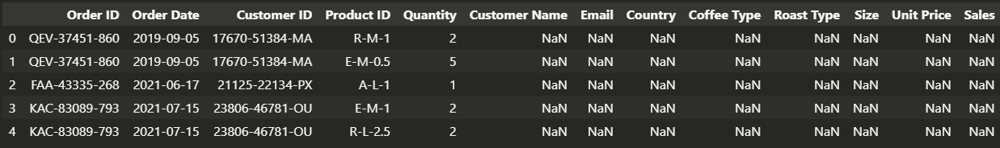
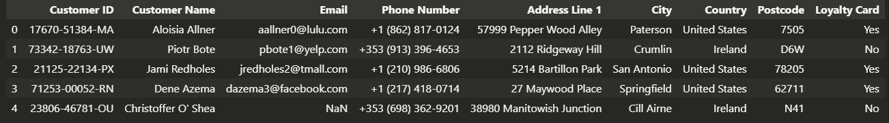
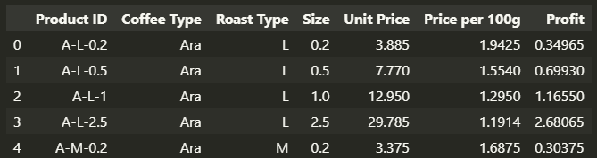
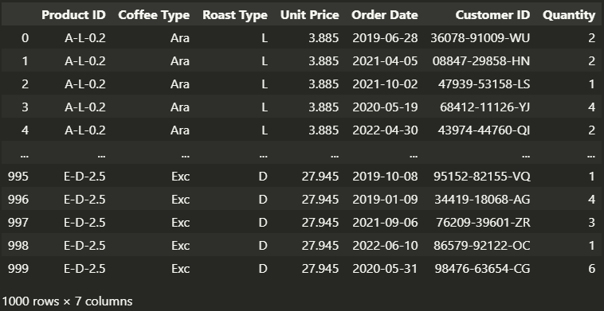
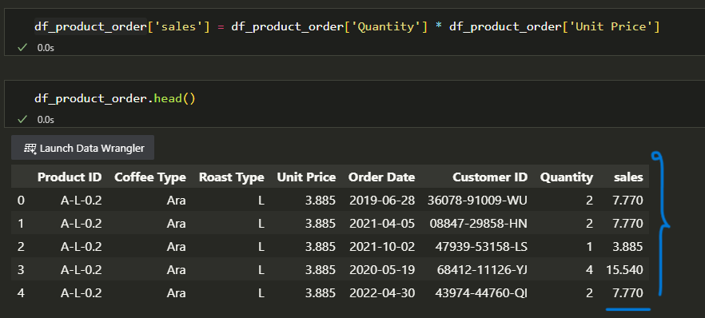

# Coffee-Bean-Sales-Analysis
In this project, I analyzed Coffee Bean Sales using Python, employing libraries such as pandas, matplotlib, and seaborn to answer my questions about this data. This included determining the most popular Coffee Type, the preferred Roast Type, visualizing the top 7 most profitable cities, assessing the most profitable country, comparing the profitability of loyalty card owners to non-owners, identifying the year with the highest sales, and exploring any relationships between unit price and quantity in customer preferences.

# Preprocessing
1) Dealing with Null data
2) Dealing with Duplicate values
3) Removing unnecessary data
4) Generate new features based on previous features

# Finding patterns and insights
1) Which Coffee Type is sold more?
2) Which Roast Type is sold more?
3) Plot the top 7 most profitable cities.
4) Which country is more profitable?
5) Which group is more profitable, loyalty card owners, or non-owners?
6) Which year had the highest sales?
7) Is there any relation between unit price and quantity? Are customers more inclined towards cheaper or more expensive products?

## Data
The detailed data was collected through https://www.kaggle.com/datasets/saadharoon27/coffee-bean-sales-raw-dataset/data?select=Raw+Data.xlsx.
  As you can see below he original dataset was a excel sheet contained 3 different sheets named **orders**, **customers** and **products**. orders sheet had 1000 rows and 13 columns, customers sheet had 1000 rows and 9 columns and products sheets had 48 rows and 7 columns.

<h4>Orders Dataframe</h4>

<h4>Cutomers Dataframe</h4>

<h4>Products Dataframe</h4>

## Auditing data
To ensure that it meets quality standards and is fit for my intended purpose, I removed all null columns of orders dataframe. Also, I remove unnecessary data from customers and products dataframe such as Customer Name, Email, Phone Number Address Line, Size and Postcode.

<h4>Generating new feature</h4>
As the final step of data preprocessing, I created a new feature called 'Sales' by merging the 'Unit Price' column from the 'products' dataframe with the 'Quantity' column from the 'orders' dataframe and multiplying the values in the two columns.

## Which airline has the most flights?
This is a list of all the airlines along with the count of their flights. As we can see, WN airline had the highest number of flights among all the airlines. Additionally, I have created a legend for this plot based on another dataset named "airline" using a one-to-many relationship between the two datasets.
<h4>Products_orders Dataframe before generating new feature:</h4>

<h4>Products_orders Dataframe after generating new feature:</h4>

## At which day the delay was higher?
This plot displays the total count of delays for all airlines based on the days of the week. We can observe that the majority of delays occurred on Friday. 

However, a question arises: which airline had the most delays among all the airlines on Friday?
## At what hour the delay was higher for each airline?
This plot is a heatmap that visualizes the count of flight delays for different airlines across various days of the week. I chose to use a heatmap because I had three variables, and I wanted to examine the relationship between these three variables. Therefore, a heatmap was a suitable choice for this analysis. As we can see in the plot, the WN airline had the highest number of delays, and these delays were more frequent on Fridays compared to other days.

## Count delays that are less than 5 min, between 5 and 45 min and more than 45 min
This plot shows the number of different types of flight delays: those under 5 minutes, those between 5 and 45 minutes, and those over 45 minutes. Regardless of the airline, long delays (over 45 minutes) make up only a small percentage. However, the proportion of delays in these categories varies by airline. For example, SkyWest Airlines has about 30% fewer long delays compared to medium delays (5-45 minutes), whereas Southwest Airlines has four times fewer long delays than medium delays.

## Conclusion
In conclusion, the provided visualizations and data present several key insights about airline flights and delays:

**Airline Count:** The list of airlines and their respective flight counts highlights that WN airline had the most flights among all the airlines, indicating their significant presence in the dataset.

**Day-Based Delays:** The plot illustrating delays based on days of the week indicates that the majority of flight delays occurred on Fridays. This information can be valuable for both airlines and passengers when planning their travel schedules.

**Heatmap Analysis:** The heatmap visualization, which examines flight delays across different airlines and days of the week, provides a comprehensive overview of how delays are distributed. It helps us understand that WN airline had the highest number of delays, particularly on Fridays. This insight can guide airline companies in identifying areas for improvement in their scheduling or operations.

**Delay Categories:** The plot that categorizes delays into three groups (under 5 minutes, 5-45 minutes, and over 45 minutes) for various airlines reveals that, regardless of the airline, long delays (over 45 minutes) constitute a relatively small portion of the delays. However, the distribution of delays in these categories varies between airlines, with some airlines experiencing a higher proportion of medium delays (5-45 minutes) compared to long delays.

These insights can be valuable for airlines and travelers alike. Airlines can use this information to optimize their operations and minimize delays, especially on Fridays. Passengers can make more informed decisions when planning their trips, potentially avoiding peak delay times and airlines with specific delay patterns.

